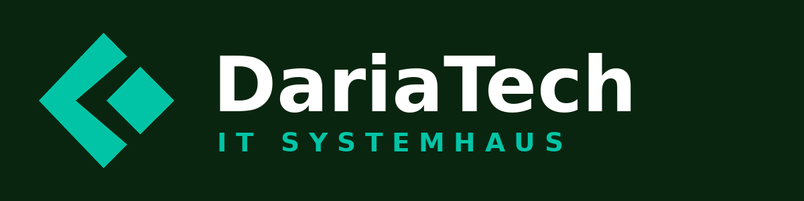

<p align="center">
  <br>
  <b>DariaTech Fernwartung</b> – die Fernwartungslösung des IT-Systemhauses DariaTech<br>
  <i>Powered by <a href="https://github.com/rustdesk/rustdesk">RustDesk</a> (Open Source)</i>
</p>

---

**DariaTech Fernwartung** ist die auf [RustDesk](https://github.com/rustdesk/rustdesk) basierende
Remote-Desktop-Anwendung der DariaTech. Name, Logo und Icons wurden auf das
DariaTech-Branding angepasst; die technische Basis (Protokoll, Binärname `rustdesk`,
Konfigurationspfade) bleibt unverändert kompatibel zu RustDesk.

> [!Caution]
> **Hinweis zur Nutzung:** Diese Software darf ausschließlich für autorisierte
> Fernwartung eingesetzt werden. Unbefugter Zugriff auf fremde Geräte ist untersagt.

## 📥 Download

Fertige Installationspakete gibt es unter
[**Releases**](../../releases) – dort liegen nach jedem Build:

| Plattform | Datei |
|-----------|-------|
| Windows (empfohlen) | `rustdesk-<version>-x86_64.exe` (portabel) / `rustdesk-<version>-x86_64.msi` (Installation) |
| macOS | `rustdesk-<version>-x86_64.dmg` / `rustdesk-<version>-aarch64.dmg` |
| Linux | `.deb`, `.rpm`, AppImage, Flatpak |
| Android | `rustdesk-<version>-universal-signed.apk` |

> Die Dateien heißen aus technischen Gründen weiterhin `rustdesk-…` –
> Anzeigename und Logo in der App sind DariaTech Fernwartung.

## 📖 Anleitungen

- [**Anleitung für Kunden**](docs/ANLEITUNG-KUNDEN.md) – Programm herunterladen, starten und dem Techniker Zugriff geben (2 Minuten).
- [**Anleitung für Mitarbeiter**](docs/ANLEITUNG-MITARBEITER.md) – Verbindungen aufbauen, Funktionen, neue Versionen über GitHub Actions bauen.
- [**Branding-Dokumentation**](BRANDING.md) – wie Name/Logo angepasst wurden und wie die Assets neu erzeugt werden.

## 🏗️ Neue Version bauen (GitHub Actions)

Die Installer für alle Plattformen werden direkt von GitHub Actions gebaut –
es ist keine lokale Build-Umgebung nötig:

1. Im Repository auf **Actions → „DariaTech Release Build“** gehen.
2. **Run workflow** anklicken (optional einen Release-Tag angeben, Standard: `fernwartung`).
3. Nach Abschluss (ca. 1–2 Stunden) liegen alle Installer unter **Releases** beim angegebenen Tag;
   zusätzlich hängen die Rohdateien als *Artifacts* am Workflow-Lauf.

Alternativ startet ein Push eines Versions-Tags (z. B. `v1.4.6`) automatisch den
gleichen Build (`flutter-tag.yml`).

Details und Voraussetzungen (optionale Signatur-Secrets etc.) stehen in der
[Anleitung für Mitarbeiter](docs/ANLEITUNG-MITARBEITER.md#neue-version-bauen-github-actions).

## 🖥️ Eigener Server

Standardmäßig nutzt die App die öffentlichen RustDesk-Rendezvous-Server. Für den
Firmeneinsatz empfiehlt sich ein eigener ID-/Relay-Server
([rustdesk-server](https://github.com/rustdesk/rustdesk-server), auch als Docker-Image).
Die Zugangsdaten werden in der App unter **Einstellungen → Netzwerk → ID-/Relay-Server**
eingetragen (siehe Mitarbeiter-Anleitung).

## 🔧 Lokal entwickeln / bauen

Der Quellcode entspricht RustDesk; es gelten die
[offiziellen Build-Anleitungen](https://rustdesk.com/docs/en/dev/build/). Kurzfassung:

- Rust-Toolchain + C++-Build-Umgebung + [vcpkg](https://github.com/microsoft/vcpkg)
  (`VCPKG_ROOT` setzen, Pakete: `libvpx libyuv opus aom`)
- Desktop-UI: Flutter (Version siehe `.github/workflows/flutter-build.yml`)
- Build: `python3 build.py --flutter` (bzw. `cargo run` für die Entwicklungsversion)

Docker-Build (Linux):

```sh
git clone <dieses Repository>
cd DariaTech-Fernwartung
git submodule update --init --recursive
docker build -t "rustdesk-builder" .
docker run --rm -it -v $PWD:/home/user/rustdesk -v rustdesk-git-cache:/home/user/.cargo/git -v rustdesk-registry-cache:/home/user/.cargo/registry -e PUID="$(id -u)" -e PGID="$(id -g)" rustdesk-builder
```

### Projektstruktur (Auszug)

- **`src/`** – Rust-Kern (Server-Dienste, Plattform-Code, Verbindungsaufbau)
- **`flutter/`** – Benutzeroberfläche (Desktop & Mobile)
- **`libs/hbb_common`** – Videocodec, Konfiguration, Netzwerk, Dateiübertragung
- **`libs/scrap`** – Bildschirmaufnahme
- **`libs/enigo`** – Tastatur-/Maussteuerung
- **`tools/branding/`** – Skripte zum Erzeugen der DariaTech-Logos und -Icons
- **`.github/workflows/`** – CI/Build-Pipelines (Artefakte & Releases)

## ⚖️ Lizenz & Attribution

Dieses Projekt ist ein Fork von [RustDesk](https://github.com/rustdesk/rustdesk)
und steht wie das Original unter der [AGPL-3.0-Lizenz](LICENCE).
„RustDesk“ ist ein Projekt von Purslane Ltd. – die Attribution
**„Powered by RustDesk“** wird in der App (Startbildschirm und Info-Dialog) angezeigt.
